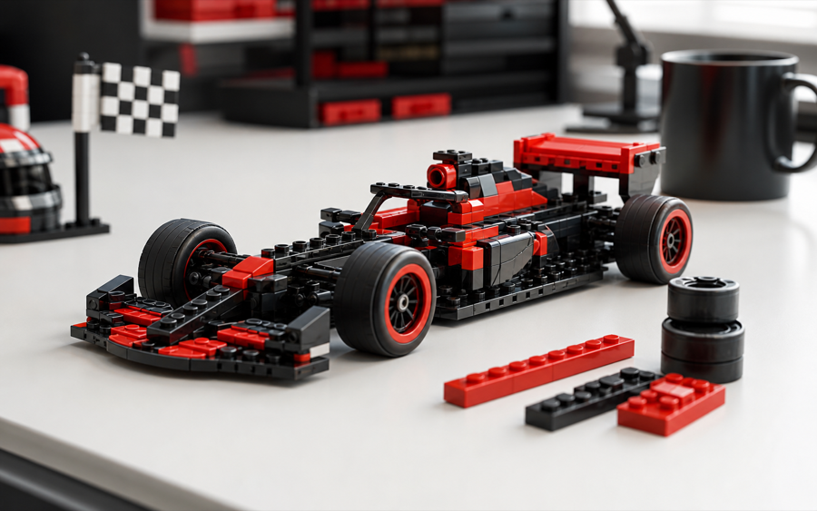

# Trend-Fit GTM Agent

**一个用来判断“这个产品该不该追这个热点”的 GTM 决策工作台。**

Trend-Fit GTM Agent 位于“趋势发现工具”和“达人/投放工具”之间：前者告诉你什么正在流行，后者告诉你谁有流量，而这个项目回答更难的问题：产品和热点是否真的适配，有什么证据支持，建议是否强到足以执行。

它是一个确定性的决策框架，不是销量预测器，也不是自动爬取全网热点的工具。

## 演示入口

线上演示（已部署到 Vercel，无需本地环境，公开 demo 默认走 fixture，不暴露 key）：

- 官网首页：[https://trend-fit-seven.vercel.app](https://trend-fit-seven.vercel.app)
- GTM 工作台：[https://trend-fit-seven.vercel.app/workspace](https://trend-fit-seven.vercel.app/workspace)
- 主证据案例：[https://trend-fit-seven.vercel.app/report?case=demo_fashion](https://trend-fit-seven.vercel.app/report?case=demo_fashion)

本地运行：

```bash
npm install
npm run dev
```

然后打开 `http://127.0.0.1:3000` 或 `http://localhost:3000`。

`/workspace` 已内置 Google Trends fixture 回放路径，因此公开演示时可以不暴露 SerpApi key。

## 产品预览

首页已经改成中文展示页：首屏是证据决策中心，下面依次展示可信度条、证据纪律、工作台预览和案例图。

| 中端男装 × 静奢风 | AI 图片工具 × 前后对比 | 零食品牌 × 迪拜巧克力 | LEGO × F1 候选热点 |
|---|---|---|---|
|  |  |  |  |

## 这个项目解决什么

GTM 团队看到一个热点时，常见选择都很粗糙：

- 不追，可能错过真实机会。
- 硬追，可能做出尴尬、廉价或伤害品牌的 campaign。

真正有价值的是中间层判断：

- 热点受众是否匹配产品目标客户？
- 产品能否自然进入热点语境，而不是强行蹭？
- 卖点和热点之间有没有清晰的信息桥梁？
- 时机、商业意图和品牌安全有什么证据支撑？
- 该付费放大、创作者种草、小范围测试，还是直接 No-go？

Trend-Fit 把这套判断显性化、结构化，并保留可审计的证据链。

## 当前能力

- `/workspace` 可编辑产品、市场、候选热点、七维锚点分和证据行。
- 支持单热点评分，也支持 3 个候选热点排序。
- 七维评分固定在 `{0, 25, 50, 75, 100}` 锚点上，避免伪精度。
- 证据只能按锚点整档修正分数，不能随意加减小数。
- source-tier classifier 决定证据等级，防止品牌自述、榜单软文和未验证搜索结果抬高置信度。
- Strong Go evidence gate、无证据封顶、推荐稳定性和行动类型都已接入。
- SerpApi Google Trends 通过服务端 API 调用，浏览器不接收 key。
- 支持 fixture 回放、JSON 导入导出、本地自动保存、Markdown 报告导出。

当前刻意不做：

- 自动从 TikTok、X、Instagram、小红书抓取全网热点。
- 抓取达人联系方式。
- 接入广告平台开户或投放 API。
- 做登录、数据库、支付或云端持久化。
- 假装权重已经用真实 campaign 结果校准过。

## 证据纪律

这个项目最强的部分不是“能给高分”，而是“知道什么时候不能过度承诺”。

| 规则 | 防止什么问题 |
|---|---|
| **没有数据不等于有证据** | 缺失、近乎为零或互相矛盾的来源不会变成正向结论。 |
| **证据等级由分类器决定** | Agent 和用户不能把弱来源手动升级成强证据。 |
| **Strong Go 必须有非代理证据** | 原始高分如果只靠代理指标，会被门槛降级。 |
| **不伪造校准** | 权重被诚实标注为专家先验，直到有真实 campaign 数据。 |

例子：中端男装 × 静奢风在证据修正后是 `88 / 100`，但因为人群/场景支持仍偏代理指标，门槛后的建议是“建议跟进”，而不是“强烈建议跟进”。

## Demo 案例

| 案例 | 基准分 | 证据修正后 | 门槛后结论 | 说明 |
|---|---:|---:|---|---|
| 中端男装 × 静奢风 | 90 | 88 | 建议跟进 | 时机被下修，代理证据阻止 Strong Go。 |
| AI 图片工具 × 前后对比 | 89 | 86 | 强烈建议跟进 | 场景证据通过，但品牌安全让稳定性偏脆弱。 |
| 零食品牌 × 迪拜巧克力 | 81 | 76 | 建议跟进 | 饱和与跟风风险降低置信度。 |
| 即饮蛋白饮料 × 日常蛋白摄入 | 78 | 85 | 强烈建议跟进 | 健康和商业信号抬高分数，但刚过阈值。 |
| LEGO × F1 比赛周末排序 | 88 | 88 | 强烈建议跟进 | F1 在证据门槛后胜过世界杯和毕业季礼物。 |

报告文件在 [`outputs/`](outputs/)，结构化输入和证据在 [`data/`](data/)。

## 评分模型

每个维度只允许 `0`、`25`、`50`、`75`、`100` 五档锚点。

| 维度 | 权重 | 核心问题 |
|---|---:|---|
| 人群重合 | 20% | 热点受众是否匹配目标客户？ |
| 场景适配 | 20% | 产品能否自然参与热点？ |
| 信息桥梁 | 15% | 热点和产品价值之间是否有清晰连接？ |
| 创意可行 | 15% | 团队能否做出符合平台语境的内容？ |
| 商业意图 | 10% | 受众是否接近购买、试用或咨询心智？ |
| 品牌安全 | 10% | 是否存在价值观、语气或声誉风险？ |
| 时机热度 | 10% | 热点是否仍然有窗口期，而不是已经拥挤？ |

展示总分为确定性计算：`floor(weightedRaw + 0.5)`。

决策区间：

| 分数 | 结论 |
|---:|---|
| 85-100 | 强烈建议跟进 |
| 70-84 | 建议跟进 |
| 55-69 | 谨慎测试 |
| 40-54 | 弱适配 |
| 0-39 | 不建议 |

硬性覆盖规则：

1. `brandSafety <= 25` 时，最高只能到“谨慎测试”。
2. 低风险偏好且 `brandSafety < 50` 时，强制“不建议”。
3. `audienceOverlap <= 25` 且 `useCaseRelevance <= 25` 时，最高只能到“弱适配”。

## 架构

项目核心是稳定的评分合同，上面叠加证据修正和严谨性门槛。

| 模块 | 主要文件 |
|---|---|
| 评分合同 | [`lib/scoring.ts`](lib/scoring.ts)、[`tests/scoring.test.ts`](tests/scoring.test.ts) |
| 证据修正 | [`lib/evidence-adjustment.ts`](lib/evidence-adjustment.ts)、[`tests/evidence-adjustment.test.ts`](tests/evidence-adjustment.test.ts) |
| 推荐严谨性门槛 | [`lib/recommendation-rigor.ts`](lib/recommendation-rigor.ts)、[`tests/recommendation-rigor.test.ts`](tests/recommendation-rigor.test.ts) |
| 来源等级分类器 | [`lib/source-tier-classifier.ts`](lib/source-tier-classifier.ts)、[`tests/source-tier-classifier.test.ts`](tests/source-tier-classifier.test.ts) |
| 证据收集草稿 | [`lib/evidence-collector.ts`](lib/evidence-collector.ts)、[`lib/evidence-case-research-runner.ts`](lib/evidence-case-research-runner.ts) |
| Google Trends Provider | [`lib/seo-keyword-provider.ts`](lib/seo-keyword-provider.ts)、[`app/api/workspace/google-trends/route.ts`](app/api/workspace/google-trends/route.ts) |
| 工作台桥接 | [`lib/workspace-evaluator.ts`](lib/workspace-evaluator.ts)、[`components/WorkspaceClient.tsx`](components/WorkspaceClient.tsx) |
| 候选热点排序 | [`lib/trend-shortlist.ts`](lib/trend-shortlist.ts)、[`tests/trend-shortlist.test.ts`](tests/trend-shortlist.test.ts) |
| 报告输出 | [`lib/report-markdown.ts`](lib/report-markdown.ts)、[`app/api/report/[id]/route.ts`](app/api/report/[id]/route.ts) |

本地 strategy skills 在 [`skills/`](skills/) 下：

- `trend-product-fit`
- `evidence-collector`
- `competitor-evidence`
- `trend-shortlist`
- `campaign-generator`
- `outreach-copy`

## 路由

| 路由 | 用途 |
|---|---|
| `/` | 中文官网首页和项目展示页。 |
| `/workspace` | 主工作台：评分、排序、证据行、fixture 回放、导入导出、Markdown 导出。 |
| `/product-profile` | Demo 产品档案页。 |
| `/trend-input` | Demo 热点输入页。 |
| `/fit-score` | 七维评分拆解和推荐结果。 |
| `/report` | 按案例渲染完整 GTM 简报。 |
| `/api/report/[id]` | 下载已知案例的 Markdown 报告，未知 id 会回退到默认 demo。 |
| `/api/workspace/google-trends` | 服务端 SerpApi Google Trends 调用，或 fixture 回放。 |

常用 query 参数：

- `case=demo_fashion|demo_robotics|demo_ai_tool|demo_snack|demo_protein_drink`
- `profile=default|brand_awareness|ecommerce_conversion|b2b_pipeline|creator_seeding|risk_sensitive`

## API 示例

### `GET /api/report/[id]`

下载某个 demo 报告：

```bash
curl -i https://trend-fit-seven.vercel.app/api/report/demo_fashion
```

### `POST /api/workspace/google-trends`

使用已提交的 fixture 回放，不需要 API key：

```bash
curl -X POST https://trend-fit-seven.vercel.app/api/workspace/google-trends \
  -H "Content-Type: application/json" \
  -d '{
    "product": "LEGO",
    "market": "Global / Europe",
    "trend": "F1 race weekend",
    "fixture": true
  }'
```

真实 SerpApi 调用需要服务端环境变量 `SERPAPI_API_KEY`。不要在浏览器输入或公开仓库里放 key。

## 部署与固定域名

已部署到 Vercel，线上地址：**[https://trend-fit-seven.vercel.app](https://trend-fit-seven.vercel.app)**（README 顶部“演示入口”即为此地址；公开 demo 默认走 fixture，不暴露 key）。

如果之后想用更正式的自定义域名：

1. 购买或使用自己的域名，例如 `trendfitgtm.com` 或 `gtm.yourdomain.com`。
2. 在 Vercel 项目 `Settings -> Domains` 添加域名，按 Vercel 给出的 DNS 记录配置。
3. 子域名通常用 CNAME 指向 Vercel；根域名按 Vercel 控制台提示配置 A/CNAME 记录。

注意：公开部署前轮换任何在聊天或截图里出现过的 SerpApi key。真实 SerpApi 调用走服务端环境变量 `SERPAPI_API_KEY`，公开 demo 不依赖它。

## 脚本

| 命令 | 说明 |
|---|---|
| `npm run dev` | 启动 Next.js 开发服务。 |
| `npm run build` | 构建生产版本。 |
| `npm start` | 运行生产构建。 |
| `npm test` | 运行所有 Node 测试。 |
| `npm run evidence:case` | 从显式证据数据生成 evidence case。 |
| `npm run evidence:case:research` | 运行研究 provider 管线，写入 `data/*_evidence.json` 和 `outputs/*_evidence_case.md`。 |

## 环境变量

| 变量 | 是否必须 | 用途 |
|---|---|---|
| `SERPAPI_API_KEY` | 仅真实 Google Trends 调用需要 | 服务端 SerpApi Google Trends key；fixture 回放不需要。 |
| `OPENCLI_BIN` | 可选 | 覆盖 `opencli` 二进制路径。 |

## 验证

推荐在提交或部署前运行：

```bash
npm test
npm run build
```

CI 通过 [`.github/workflows/ci.yml`](.github/workflows/ci.yml) 在 push 和 pull request 时运行 `npm ci`、`npm test` 和 `npm run build`。

本次首页改版还需要浏览器检查：

- 桌面视口：首屏能打开，无横向溢出，案例图正常加载。
- 手机视口：标题、按钮、决策面板和案例卡片不重叠。

## 目录结构

```text
trend-fit-gtm-agent/
├── app/                         # Next.js 页面和 API routes
├── components/                  # 共享 UI 组件
├── data/                        # Demo 案例和结构化证据 JSON
├── docs/                        # 当前状态、changelog、研究 CLI 说明
├── examples/                    # 可重复演示的 fixture
├── lib/                         # 评分、证据、provider、报告和工作台逻辑
├── outputs/                     # 生成的 Markdown 报告和 evidence cases
├── public/case-studies/         # 首页案例缩略图
├── skills/                      # 本地策略 skill 定义
└── tests/                       # Node 测试套件
```

## 当前缺口

- 已部署到 Vercel（[trend-fit-seven.vercel.app](https://trend-fit-seven.vercel.app)），暂未绑定自定义域名。
- 热点仍需要人工输入；产品到热点的自动发现暂不在本版范围内。
- TikTok、小红书、市场评论、社媒语言等 live provider 还没有接入工作台 UI。
- 如果旧 SerpApi key 曾在聊天中共享，公开部署前必须轮换。

## 技术栈

Next.js 15 · React 19 · TypeScript · Tailwind CSS · Node test runner
